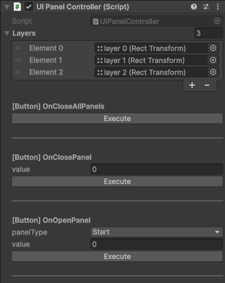

# Unity-InvokeMethod-WithInspectorButton

A Unity Editor tool that lets you invoke your methods directly from the Inspector using a `[Button]` attribute.  
Easily test and trigger functions without entering Play Mode or writing temporary debug code.

---

## 📌 How to Use

1. Create a folder in your project:  
   `Assets/Scripts/CustomEditorScripts/`
2. Move both scripts into the folder.  
3. Add the `[Button]` attribute to any method in your MonoBehaviour.  
4. The method will appear in the Inspector with an **Execute** button.

---

## ✅ Supported Types

- **`int`** → `EditorGUILayout.IntField`  
- **`float`** → `EditorGUILayout.FloatField`  
- **`string`** → `EditorGUILayout.TextField`  
- **`bool`** → `EditorGUILayout.Toggle`  
- **`byte`** → `EditorGUILayout.IntField` with byte cast  
- **`enum`** → `EditorGUILayout.EnumPopup`  

Unsupported types will display:  
`(Unsupported type <TypeName>)`

---

## 🖼️ Example Inspector



---

## 💻 Example Usage

```csharp
using UnityEngine;

public class MyTestScript : MonoBehaviour
{
    [Button]
    private void SayHello()
    {
        Debug.Log("Hello from Inspector!");
    }

    [Button]
    private void SetPanel(UIPanelTypes panelType, int layerIndex)
    {
        Debug.Log($"Opening panel: {panelType} at layer {layerIndex}");
    }
}

public enum UIPanelTypes
{
    Start,
    Level,
    Win,
    Fail
}
